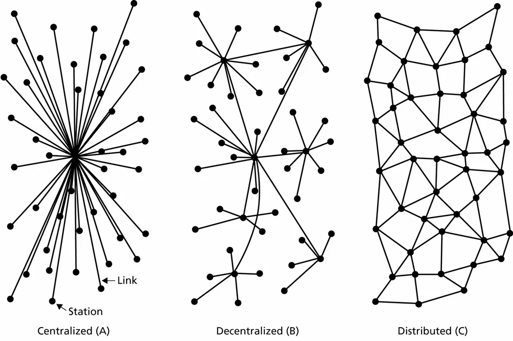
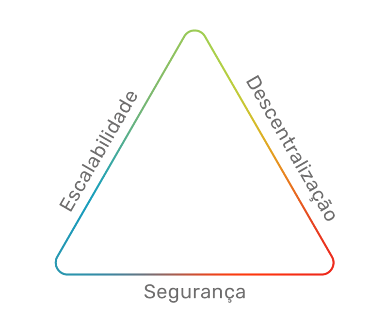
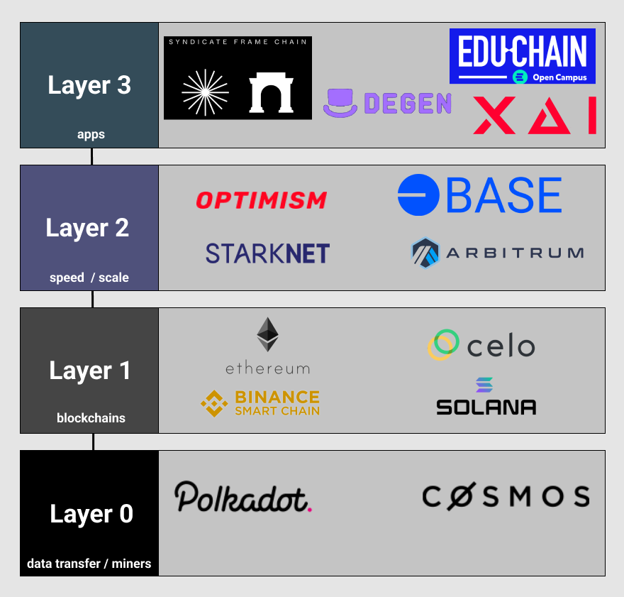

# Prefacio

Hola, joven pensador.

El viaje que vivirás con nosotros no comienza ni termina en esta comunidad, páginas, videos, certificados y tareas. 

Metafóricamente, nos gusta decir que estamos librando una batalla con la tecnología blockchain, pero la realidad es que estamos librando una guerra contra la falta de conciencia respecto a las áreas relacionadas con la tecnología.

Lo que nos interesa es cómo estas tecnologías están cambiando nuestra percepción del mundo y de nosotros mismos. Cómo la tecnología blockchain está modificando nuestras relaciones y cómo puede generar valor.

La capacidad de generar y almacenar valor está directamente relacionada con la necesidad humana de construir un entorno que lo mantenga seguro (o que al menos transmita esa sensación).

El gobierno, la medicina, la policía, la propiedad privada, los bancos, aseguradoras y muchos otros servicios, que están directamente ligados a esta necesidad, serán impactados de manera directa por esta tecnología.

Con el crecimiento de la sociedad, se crearon pactos sociales, como las relaciones laborales, el dinero, el gobierno y la idea de propiedad privada.

> “La tecnología puede definirse como la aplicación del conocimiento para alcanzar objetivos prácticos de manera específica y replicable.”

El poder de la tecnología es inmenso, y la creciente adopción/difusión de una tecnología genera un crecimiento exponencial. A partir de ese momento, las personas comienzan a construir sobre ese conocimiento, como una plataforma. 

Por ello, todo lo que se mencione aquí debe considerarse no como un punto de llegada, sino como un punto de partida para que podamos hacer las preguntas correctas y, por lo tanto, construir, con bases y fundamentos sólidos, el futuro utilizando la increíble tecnología que es blockchain.

# CLASE 1 - Cayendo en la madriguera del conejo

Internet fue y es una tecnología revolucionaria. Fue la plataforma para miles de revoluciones, así como el desarrollo de infinitas nuevas posibilidades. Internet es vista como un derecho humano y ofrece acceso y oportunidades nunca antes vistas.

Todo sucede a través de internet hoy en día, incluso cosas que antes estaban bastante restringidas a la actividad presencial, como hacer compras. Sería natural imaginar que, en algún momento, habría dinero digital, pero, por algún motivo, fue necesaria una gran crisis y un gran aumento de la desconfianza en las instituciones para que esto sucediera.

La realidad es que, desde la década de los 80, ya había personas pensando en crear una especie de dinero digital. Sin embargo, ni la mejor idea del mundo puede convencer a una persona que no percibe su utilidad. Fue solo tras el colapso de 2007/2008 que la humanidad logró el hito de “conquistar” su primera moneda digital descentralizada: el Bitcoin.

### 2008

A mediados de septiembre de 2008, con la quiebra de un banco americano tradicional (Lehman Brothers), seis semanas después, el 31 de octubre, un usuario con el nick de Satoshi Nakamoto envió un correo electrónico a una lista selecta de destinatarios de un grupo cypherpunk que contenía el whitepaper de Bitcoin.

Se produjo alguna discusión y, al año siguiente, en 2009, algunas personas comenzaron a participar en la red de Bitcoin, que es una moneda digital como ninguna otra.

El lema de Bitcoin es “Sé tu propio banco”, en parte debido a la crisis, pero también por un pensamiento preexistente de la idea de liberarse de las instituciones de control, incluidos gobiernos y bancos centrales. La abrumadora mayoría de las personas se relaciona con las criptomonedas buscando ganar dinero; en segundo lugar, están los apasionados por la tecnología, pero el grupo que más crece es el de aquellos que hacen negocios dentro de los parámetros de la blockchain, la tecnología de Bitcoin. Sin embargo, lo que inició todo fue la búsqueda de un ideal de libertad.

Bitcoin es un dinero controlado por el código, libre de errores humanos. El poder asociado a la emisión y gestión del dinero es delegado a los usuarios que permiten que la red funcione en sus computadoras. No necesita ninguna entidad adicional, opera 24 horas al día, es transparente, rastreable, no tiene CEO ni sede corporativa, pero tampoco tiene atención al cliente, y, por un error tonto, puedes perder todo tu dinero. ¿Pensaste que ser tu propio banco sería fácil?

La mayoría de las personas no quiere ser su propio banco y asumir todas las consecuencias (buenas y malas) que conlleva. La mayoría solo quiere el lado bueno, es decir, ver su patrimonio multiplicarse 10, 20, 30 veces en el mercado, pero terminan siendo susceptibles a fraudes y “necesitando” confiar en otras instituciones: los nuevos bancos, las exchanges (corredoras). Esto nos hace cuestionar, “al final del día”, si las personas realmente quieren ser sus propios bancos.

### Los imperios digitales de la información

Si nadie paga por usar Facebook, ¿cómo es que Mark Zuckerberg se convirtió en uno de los hombres más ricos del mundo? ¡Vendiendo los datos de las personas! Incluso fue investigado judicialmente por congresistas estadounidenses y dividió opiniones con sus declaraciones, a diferencia de los congresistas, que dejaron claro para todos que no entienden nada de tecnología.

Aunque no sea ilegal, es éticamente cuestionable enriquecerse vendiendo los datos de otras personas. Por esta razón, existen diversas soluciones de privacidad, como el navegador Brave (el navegador donde se está escribiendo este libro en este momento), que protegen la privacidad de quien lo utiliza y, cuando venden algún dato a algún anunciante, recompensan al usuario.

### La evolución de internet

Internet es una red de computadoras que se comunican a través de protocolos estandarizados, permitiendo que las personas accedan a archivos en computadoras de todo el mundo.

La imagen a continuación muestra una manera simplificada de cómo funciona internet. Poseemos dispositivos como computadoras y celulares que se conectan a través de cables, módems y antenas a proveedores de internet que conectan sus máquinas a la estructura de internet representada por los puntos azules.

---

### WEB 1.0:

Estuvo marcada por el inicio de internet y por el intercambio de información. A continuación, ejemplos de sitios de aquella época:

---

### WEB 2.0:

El término fue creado en 1999, pero solo fue popularizado en el año 2004, con la primera conferencia que llevaba el término en su propio título (Web 2.0 Conference).

Es “la internet” donde estamos más presentes, a través de aplicaciones como WhatsApp, YouTube, Instagram, Facebook, TikTok y otras. Aquí, la identidad pasa a ser portátil, y podemos iniciar sesión en muchos lugares con nuestras credenciales de Gmail, Facebook y algunas otras.

---

### WEB 3.0:

El término fue creado para designar la internet del valor, del intercambio de recursos y de la cooperación. Representa también, en su gran mayoría, un cambio radical de pensamiento.

Lo que hace tan valiosa a la web 3.0 son los fundamentos bajo los cuales fue desarrollada. Bitcoin puede tener un precio que oscila, pero el valor de la tecnología blockchain, creada para que este pudiera existir, rompe con diversos paradigmas.

Todo esto es posible porque la tecnología blockchain ofrece confianza a través de la creación de un sistema seguro y de registros inmutables.

---

### ¿Cuándo iremos todos a la Web 3.0?

La verdad es que nunca vamos a “mudarnos” a ninguna internet. Esta separación es solo una cuestión de clasificación y entendimiento humano, que, de cierta manera, aprecia bastante este tipo de organización.

# CLASE 2 - HISTORIA: Tecnologías que componen la blockchain

### 1973
Robert Kahn y Vinton Cerf comienzan a trabajar juntos en lo que se convertiría en el protocolo unificado de comunicación de internet, el protocolo TCP/IP.

### 1974
Robert Kahn y Vinton Cerf comienzan a trabajar juntos en lo que se convertiría en el protocolo unificado de comunicación de internet, el protocolo TCP/IP. En 1974, la primera versión fue lanzada.

### 1979
Mientras tanto, en 1979, Ralph Merkle describió un enfoque para la distribución de claves públicas y firmas digitales llamado "autenticación de árbol" (tree authentication), en su tesis doctoral para la Universidad de Stanford.

### 1982
Después de varios experimentos, el departamento militar decretó el protocolo TCP/IP como estándar para redes militares en 1982. Ese mismo año, David Chaum describió una metodología de seguridad para establecer, mantener y crear confianza dentro de sistemas informáticos, en una disertación para la Universidad de Berkeley. Esta idea ya incorporaba muchos de los conceptos actuales de blockchain.

### 1985
El protocolo TCP/IP fue adoptado por empresas como IBM, convirtiéndose en el estándar comercial.

### 1989
David Chaum inventó el dinero digital y fundó la corporación DigiCash.

### 1991
Stuart Haber y Scott Stornetta, preocupados por la integridad de los datos, crearon una solución que convierte documentos en un código único (hash), los agrupa secuencialmente y les añade una marca de tiempo, formando una cadena.

### 1992
Haber y Stornetta añadieron el árbol de Merkle, permitiendo que múltiples documentos fueran parte de un único registro.

### 1994
Haber y Stornetta fundaron su propia startup, “Surety Technology”. Sin embargo, no lograron vender su idea y tuvieron poco éxito en sus operaciones.

### 1997
Adam Back creó el **hashcash**, un algoritmo de prueba de trabajo (PoW) implementado para evitar ataques cibernéticos, verificando el esfuerzo computacional usado para limitar correos electrónicos no deseados (spam).

### 1999
El nacimiento y la muerte de Napster. A pesar de su servidor centralizado, Napster popularizó la tecnología de conexión directa entre usuarios P2P (Peer-to-peer, punto-a-punto).

### 2004
Hal Finney (Harold Thomas Finney II), científico de la computación y activista cripto, quien más tarde sería la primera persona en recibir una transacción de Bitcoin, introdujo el sistema RPoW (**Reusable Proof of Work**). Este sistema resolvió el problema del doble gasto, manteniendo los datos ampliamente disponibles y auditables en tiempo real. Más tarde, esto sería adaptado para crear el sistema de prueba de trabajo (PoW) usado en Bitcoin.

## Conclusión
Al conocer los hechos históricos, queda claro que muchas de las personas que contribuyeron a la construcción de la tecnología blockchain murieron sin imaginar cómo llegaría a ser, y además, muchas de estas personas ni siquiera obtuvieron beneficios reales con sus actividades, ya fueran académicas o incluso comerciales, como en el caso de Surety Technologies de Haber y Stornetta.

La construcción de esta revolución se dio por motivos ideológicos mucho más que intelectuales o comerciales. Algunos fragmentos de la tecnología blockchain fueron, de hecho, creados de manera teórica para resolver un problema hipotético en una época en que ni siquiera existía la difusión de internet o alguna percepción de su posible valor.

# CLASE 3 - ¿Qué es exactamente, cómo funciona y para qué sirve la blockchain?

La blockchain es un conjunto de tecnologías de registro distribuido inmutable, es decir, sirve para generar confianza. Muchos computadores participan, creando un entorno seguro dentro de internet, para crear registros inmutables que están interconectados secuencialmente (en una "cadena de bloques"). Estos pueden ser públicos, privados o híbridos.

El papel de las instituciones bancarias, por ejemplo, es crear un entorno seguro para que las personas puedan almacenar y transaccionar valores. Sin embargo, es natural que, una vez que una institución, sea cual sea, base sus actividades en decisiones humanas, siempre habrá consecuencias relacionadas con la falible naturaleza humana y, aunque algunos errores puedan ser honestos, el precio puede ser muy alto.

Es natural que la tecnología blockchain sea implementada cada vez más para reemplazar a las instituciones. De esta forma, quien gestionará las relaciones será el código, previniendo errores humanos mientras crea un sistema transparente y seguro. Por ello, estamos ante una revolución que puede ser tan significativa como el propio surgimiento de internet.

### Mecanismos de consenso
Son reglas/critérios que deben seguirse para poder escribir nuevos bloques de información, a través de un proceso llamado "minería", donde los participantes de la red verifican y registran nuevos bloques de información. Cada red puede tener su propio mecanismo de consenso, pero existen dos principales: Proof-of-Work (prueba de trabajo) y Proof-of-Stake (prueba de participación).

El objetivo de ambos mecanismos es registrar las transacciones, aunque funcionan de maneras completamente diferentes. En términos generales, mientras que en el modelo Proof-of-Work (PoW) los usuarios emplean su poder computacional para mantener la seguridad de la red resolviendo problemas matemáticos, en el modelo Proof-of-Stake (PoS) los inversores con más capital invertido son seleccionados para registrar/verificar las transacciones.

En ambos casos, las transacciones son validadas por otros usuarios y quien escribe el bloque es recompensado con la moneda nativa.

### Proof of Work
En la versión de Bitcoin, para validar una transacción, los mineros compiten para descubrir quién puede generar una especie de "código de barras" muy especial que identifica exclusivamente todas las transacciones del período. Este código identificador se llama hash, y para producir un hash, el validador combina todos los datos del bloque con un número aleatorio hasta que el resultado final cumpla los criterios establecidos por la red.

En el caso de Bitcoin, se trata de la cantidad de ceros con la que comienza el código. Después de que un minero valida con éxito una transacción y la añade a un nuevo bloque de transacciones, puede transmitir el bloque al resto de la red Bitcoin.

Otros mineros y nodos de la red verifican el bloque para garantizar que sea válido y cumpla con las reglas del protocolo Bitcoin. Si el bloque es aceptado por la red, se añade a la blockchain y se convierte en una parte permanente de la cadena de bloques de Bitcoin.

El nombre "prueba de trabajo" se debe al gran esfuerzo computacional involucrado en la cantidad de intentos y cálculos matemáticos necesarios para encontrar un hash.

### Proof of Stake
Utilizado en Ethereum, el algoritmo de consenso Proof of Stake (PoS) de Ethereum asigna a los validadores un papel crucial en la garantía de la integridad y seguridad de la red, compitiendo tecnológicamente y criptográficamente entre sí, verificando que cada transacción sea válida y cumpla las reglas de la red.

Para convertirse en un validador en la red, un individuo u organización debe poseer al menos 32 ethers asignados/bloqueados en la red. Según la cantidad de tokens asignados, se seleccionan los validadores: cuantos más tokens tenga un validador, mayor será la probabilidad de ser seleccionado para validar transacciones y ganar ETH como recompensa.

El nombre "prueba de participación" se debe a que el validador demuestra su compromiso al asignar sus recursos a la red, lo que también define cuán activamente participa en el proceso de validación.

## Mecanismos de consenso alternativos

### Delegated Proof of Stake (DPoS)
Muy similar al PoS, pero permite que los inversores deleguen su poder de voto a otro usuario en el proceso de toma de decisiones, favoreciendo la escalabilidad y eficiencia de la red.

### Proof of Authority (PoA)
Muy útil para blockchains privadas y permissionadas. Los criterios son definidos por una entidad central que, basada en la reputación y confiabilidad, selecciona nodos para validar las transacciones.

### Proof of Elapsed Time (PoET)
En sistemas permissionados, donde ya existe confianza, los validadores son elegidos con base en el tiempo que han estado inactivos, es decir, básicamente "el último en la fila" es seleccionado.

### Proof of History (PoH)
Un mecanismo que registra el tiempo entre eventos de manera criptográfica, creando una línea de tiempo verificable utilizando funciones hash secuenciales. Cada evento o transacción recibe una marca temporal única, lo que permite que los nodos validen el orden de los acontecimientos sin necesidad de sincronizarse constantemente entre sí. Esto hace que el procesamiento de transacciones sea más rápido y eficiente, siendo especialmente útil para blockchains de alto rendimiento.

## Conclusión
Dependiendo del propósito, tamaño de la operación y cantidad de recursos, uno u otro mecanismo puede ser mejor.

Lo más importante es analizar todos de manera crítica y comprender sus características, y en qué situaciones actúan como defectos o cualidades.

La elección del mecanismo de consenso debe ser más que una decisión romántica o basada en la economía de recursos; debe ser una decisión de negocios que sea coherente con los valores y objetivos del proyecto.

El objetivo es establecer confianza creando registros encriptados y distribuidos que sean asegurados y escritos de manera descentralizada y auditable respetando mecanismos/algoritmos de consenso.

# CLASE 4 - Características y formatos de la blockchain

## Características

### 1. Descentralizada/Distribuida

Las blockchains pueden operar sin ser controladas por entidades u organizaciones. La manera en que generan confianza es utilizando una red de computadores para validar y registrar transacciones, eliminando la necesidad de intermediarios.

La descentralización genera mayor seguridad y transparencia tanto de manera técnica como institucional, ya que este atributo no solo es un modelo tecnológico, sino también un modelo organizativo que distribuye el poder, como por ejemplo, para crear y controlar dinero. Al no haber un punto central de control, es mucho más difícil que los hackers ataquen la red o que las actividades fraudulentas pasen desapercibidas.

Además, todas las transacciones pueden ser registradas en un libro público, como en el caso de Bitcoin. Sin embargo, una característica inherente a las redes muy descentralizadas es su bajo rendimiento en comparación con redes centralizadas.

### 2. Segura

La tecnología blockchain es segura debido al uso de la criptografía. La criptografía es una práctica de comunicación segura que implica el uso de algoritmos matemáticos complejos para codificar y decodificar mensajes.

En el contexto de blockchain, la criptografía se utiliza para proteger los datos almacenados en la red, así como para verificar la autenticidad de las transacciones.

### 3. Inmutable

La inmutabilidad de la tecnología blockchain se refiere a la imposibilidad de modificar o eliminar datos registrados previamente.

Esto se logra mediante el uso de “hashes”, códigos identificadores únicos, como una especie de "huella digital" que cambia por completo si se altera incluso un solo detalle, como una coma.

Sin embargo, esta característica puede ser negativa en caso de errores, ya que no es posible revertir ni corregir registros. Por este motivo, los mecanismos de consenso son cruciales.

### 4. Anónima

Las transacciones en una blockchain se registran utilizando una dirección única que no revela información personal sobre el usuario.

Esto permite a los usuarios realizar transacciones sin revelar su identidad. Sin embargo, una vez que la dirección pública de un usuario es descubierta, todo su historial de transacciones puede ser rastreado, ya que los registros en una blockchain son inmutables.

### 5. Unánime

Para que una nueva transacción sea registrada, todos los participantes de la red deben estar de acuerdo con su validez.

Esto garantiza la integridad y seguridad de la blockchain, ya que cualquier intento de manipulación será rápidamente detectado y rechazado por la red, además de que el participante será sancionado.

La unanimidad se puede lograr a través de mecanismos como Proof-of-Work (PoW) o Proof-of-Stake (PoS), entre otros, donde los validadores tienen un interés económico en mantener la red segura.

### 6. Temporizada

Los registros tienen marcas de tiempo tanto para la creación del código identificador único (hash) como para garantizar que las transacciones se procesen de manera justa y transparente.

Esta característica de registro temporal es crítica para establecer confianza en el sistema.

### 7. Transparente (o no)

En una blockchain pública, todos pueden leer y auditar las transacciones, fomentando la confianza y la transparencia. En blockchains privadas, sin embargo, el acceso a los datos puede estar restringido, dependiendo de los permisos otorgados.

---

## Modelos de blockchain

Los tipos de blockchain se clasifican según **permisión** y **transparencia**.

En términos de **permisión**:
1. **Con permiso**
   - Solo los participantes autorizados pueden validar o registrar transacciones. Ideal para organizaciones con redes restringidas.
2. **Sin permiso**
   - Cualquier persona puede participar en la red sin necesidad de autorización previa. Ejemplo: Bitcoin.

En términos de **transparencia**:
1. **Pública**
   - Abierta a todos; cualquier persona puede participar como usuario, minero o desarrollador. Generalmente descentralizada.
2. **Privada**
   - Controlada por una entidad específica. Más rápida y eficiente, pero menos transparente.

---

## Casos de uso

Algunos posibles casos de uso son:
- **Criptomonedas:** Bitcoin y Ethereum permiten transacciones sin intermediarios.
- **Gestión de la cadena de suministro:** seguimiento de mercancías de manera eficiente.
- **Identidad digital:** almacenamiento seguro y validación de identidades.
- **Votación:** sistemas transparentes y seguros.
- **Registro de activos:** propiedades o vehículos.
- **Salud:** almacenamiento y acceso seguro a registros médicos.
- **Educación:** certificación de credenciales académicas.
- **Gobierno:** simplificación de servicios y apoyo a la democracia directa.
- **Seguros:** procesos más rápidos y seguros.
- **Arte y música:** autenticidad, distribución de derechos y regalías.
- **IoT:** intercambio seguro de datos entre dispositivos.
- **Cartorios y registros notariales:** servicios más accesibles y baratos.

---

## Recapitulación

- **Blockchain es una tecnología de registros distribuidos e inmutables.**
- Su valor radica en la confianza que genera, eliminando la dependencia de instituciones centralizadas.
- **Web 3.0 permite cooperación global y segura, potenciando nuevas formas de organización.**
- Su impacto real en la sociedad es profundo y transformador.

Blockchain utiliza **criptografía**, **mecanismos de consenso** y **redes distribuidas** para lograr todo esto.

# CLASE 5 - Detrás de la blockchain: tecnologías pilares

## ¿Cómo funciona Internet?

Comprender internet implica varias capas. Están los usuarios que solo necesitan saber la URL de los sitios que visitan, los que estudian o crean contenido y requieren un dominio mayor de las herramientas, los especialistas/desarrolladores y, finalmente, los "evangelistas". El término “evangelista” surgió al inicio de internet para describir a expertos que promovían su adopción comunicando sus utilidades al público y ampliando su alcance.

---

### Características de Internet

- **Descentralizada**: Internet no tiene un único punto de control. Está compuesta por muchas redes interconectadas gestionadas por distintas organizaciones e individuos. Sin embargo, esto no impide que existan servicios centralizados o que sea censurable.
- **Comunicación punto a punto**: Los dispositivos en internet pueden comunicarse directamente sin la necesidad de una autoridad central.
- **Escalabilidad**: Internet puede manejar grandes cantidades de dispositivos y usuarios, ya que se pueden añadir nuevos nodos con facilidad.
- **Estándares abiertos**: Basada en estándares abiertos (open source), como TCP/IP, permite la interoperabilidad entre diferentes sistemas y tecnologías.
- **Enrutamiento dinámico**: Usa algoritmos de enrutamiento para transmitir datos de manera eficiente incluso en caso de fallos o congestión.
- **Alcance global**: Permite comunicación y acceso a información desde cualquier lugar del mundo.

---

### Topologías de red

El Diagrama de Paul Baran (1964) abordó la fragilidad de los modelos centralizados y propuso otros dos: distribuidos y descentralizados. En hardware, una red distribuida permite sistemas escalables y resistentes a fallos, ya que los datos se distribuyen en múltiples nodos, garantizando disponibilidad y resistencia.

Este conocimiento fue clave para conceptualizar el sistema blockchain.

---

## Criptografía

La criptografía es la práctica de proteger información mediante codificación, permitiendo que solo personas autorizadas puedan acceder a ella. Simplificando, transforma información confidencial en un formato que solo puede entender quien tiene acceso.

### Ejemplo básico
Usando una "cifra de sustitución":
- Mensaje original: "HOLA MUNDO".
- Mensaje cifrado: "KRÑD PXQGR" (desplazando cada letra 3 posiciones en el alfabeto).

El destinatario puede descifrar invirtiendo el desplazamiento.

---

## Criptografía simétrica y asimétrica

### Criptografía de clave simétrica
- **Usa la misma clave para cifrar y descifrar**.
- Ejemplos: AES, Blowfish.
- Ventajas: rápida y eficiente para grandes volúmenes de datos.
- Desventajas: requiere compartir la clave, lo que puede ser inseguro.

### Criptografía asimétrica
- **Usa dos claves diferentes**:
  - **Clave pública**: cifra la información.
  - **Clave privada**: descifra la información.
- Ejemplos: RSA, Criptografía de Curva Elíptica.
- Aplicaciones: firmas digitales, comunicación segura.

---

## Dirección de billetera y clave privada en blockchain

En blockchain:
- **Clave pública**: dirección de la billetera compartida con otros.
- **Clave privada**: autentica transacciones, almacenada en hardware, software o servicios como exchanges.

### Ejemplo: Metamask
- Al crear una billetera, se proporciona una frase de **12 palabras** para restaurarla.
- El software gestiona las claves privadas.

---

## Cripto...moneda

Blockchain utiliza criptografía para proteger transacciones y garantizar la integridad. En una transacción:
- La clave pública del remitente cifra la transacción.
- La clave privada del destinatario la descifra, asegurando acceso exclusivo al saldo.

# Clase 6: ¿Cómo funciona la minería de Bitcoin a fondo?

## Minería de Bitcoin

La minería de Bitcoin es un proceso fundamental para validar transacciones y agregar nuevos bloques a la blockchain. La tecnología blockchain fue creada para viabilizar el Bitcoin, que cuenta con características como:

- **Oferta Deflacionaria**: Bitcoin tiene un límite de emisión de **21 millones de unidades**.
- **Proceso Descentralizado**: La minería se realiza en millones de computadoras distribuidas globalmente.

---

### Funcionamiento

Los mineros llevan a cabo un proceso de prueba y error para encontrar una **hash** válida, utilizando los siguientes elementos:

- **Transacciones**: Lista de transacciones recientes incluidas en el bloque.
- **Header del Bloque**: Metadatos sobre el bloque, incluyendo identificador de fecha/hora.
- **Nonce**: Número aleatorio generado por el minero para variar la entrada y cumplir con el nivel de dificultad de la red.
- **Dificultad Objetivo**: Valor numérico ajustado dinámicamente por la red para mantener un intervalo promedio de generación de bloques de **10 minutos**.
- **Hash del Bloque Anterior**: Hash del último bloque de la cadena, asegurando la continuidad de la blockchain.

---

### Recompensa

Aproximadamente cada 10 minutos, se genera un nuevo bloque y el minero que resuelve el cálculo del hash primero recibe una recompensa compuesta por:

1. **Nuevos Bitcoins**.
2. **Comisiones de las transacciones incluidas en el bloque**.

---

### Halving

Cada **210 mil bloques** (aproximadamente cada 4 años), la recompensa por bloque se reduce a la mitad, en un evento conocido como **Halving**.

---

### Resumen del proceso

1. Los mineros compiten para encontrar una hash que cumpla con el **objetivo de dificultad**.
2. Al encontrar una hash válida, el minero informa el nonce utilizado.
3. Otros mineros verifican la solución encontrada.
4. El minero que resuelve la hash recibe la recompensa, y el nuevo bloque es agregado a la blockchain.

# CLASE 7 - Monedas, tokens y tipos de tokens

## ¿Qué es un Token?

Un token es una representación digital de algo que puede variar desde dinero hasta bienes físicos, como una escritura de propiedad o un saco de café. Debido a la amplia variedad de elementos e ideas que pueden representarse en la blockchain, existen diferentes tipos de tokens.

---

## Diferencia entre Token y Moneda

Aunque se usan frecuentemente como sinónimos, **tokens** y **monedas** tienen funciones y características distintas en el ecosistema blockchain.

### Moneda
- **Definición**: Es el activo nativo de una blockchain. Se utiliza principalmente como medio de intercambio, reserva de valor y unidad de cuenta.
- **Características**:
  - Tiene su propia blockchain.
  - Creada para ser una forma de dinero digital.
  - Ejemplos: Bitcoin (BTC) en la blockchain Bitcoin, Ether (ETH) en la blockchain Ethereum.
- **Función principal**: Facilitar transacciones financieras y recompensar la seguridad y mantenimiento de la red (minería o staking).

### Token
- **Definición**: Es creado en una blockchain existente y puede representar una variedad de activos o utilidades.
- **Características**:
  - No tiene su propia blockchain.
  - Utiliza contratos inteligentes para su emisión y funcionamiento.
  - Ejemplos: Tether (USDT) y Uniswap (UNI), creados en la blockchain Ethereum.
- **Función principal**: Depende del tipo de token, pudiendo ser:
  - Representación de activos físicos o digitales (stablecoins, NFTs).
  - Acceso a servicios o gobernanza dentro de una plataforma.

---

### Resumen
| Característica       | Moneda                        | Token                          |
|----------------------|------------------------------|--------------------------------|
| **Blockchain propia** | Sí                          | No                            |
| **Finalidad**         | Medio de intercambio, reserva de valor | Representación de activos, utilidades específicas |
| **Ejemplos**          | Bitcoin (BTC), Ether (ETH)   | Tether (USDT), Uniswap (UNI), NFTs |

---

## Contratos inteligentes (Smart Contracts)

Los contratos inteligentes son códigos almacenados y ejecutados en la blockchain que, al activarse por condiciones predefinidas, se ejecutan automáticamente. Cada token es, esencialmente, un contrato inteligente.

---

## Tipos de Tokens

1. **Utility Tokens**  
   Tokens que otorgan acceso a productos o servicios dentro de una plataforma específica.  
   Ejemplo: Uniswap (UNI).

2. **Security Tokens**  
   Representan activos financieros, como acciones o bonos, y están regulados por autoridades financieras.  
   Ejemplo: tZero (TZRO).

3. **Asset-Backed Tokens**  
   Representan activos físicos, como oro, petróleo o bienes raíces.  
   Ejemplo: Paxos Gold (PAXG).

4. **Stablecoins**  
   Tokens cuyo valor está vinculado a un activo estable para reducir la volatilidad.  
   - **Tipos de Stablecoins**:
     - **Colateralizadas con moneda fiduciaria**: Ejemplo: Tether (USDT), USD Coin (USDC).
     - **Colateralizadas con criptomonedas**: Ejemplo: Dai (DAI).
     - **Algorítmicas**: Ajustan su oferta automáticamente. Ejemplo: UST (antes del colapso).

5. **Tokens de gobernanza**  
   Permiten a los poseedores votar sobre decisiones importantes dentro de una plataforma.  
   Ejemplo: Maker (MKR).

6. **Non-Fungible Tokens (NFTs)**  
   Representan activos únicos e insustituibles, como arte digital, coleccionables o bienes del mundo real.  
   Ejemplo: Bored Ape Yacht Club.

---

## Fungibilidad

### Objetos Fungibles
Son intercambiables por otros equivalentes. Ejemplos:
- **Oro**: 1 kg de oro 24k es igual a otro kg de oro 24k.
- **Dinero**: Una nota de $50 equivale a cinco de $10.
- **Bitcoin**: Puede dividirse y transferirse en fracciones (0,05 BTC).

### Objetos No Fungibles
Son únicos y no intercambiables. Ejemplos:
- Una casa (cada una es diferente).
- Una obra de arte.

### Utilidad de NFTs
Representan digitalmente activos no fungibles:
- Arte digital.
- Escrituras o documentos.
- Coleccionables.
- Dominios digitales.

---

## Gobernanza y DAOs

La gobernanza descentraliza el poder y distribuye decisiones entre los participantes. Esto incluye:
- **DAOs (Organizaciones Autónomas Descentralizadas)**.
- **Tokens de gobernanza** (fungibles o no fungibles).

### Funcionamiento:
- Los **contratos inteligentes** gestionan los derechos de voto.
- Los poseedores de tokens pueden:
  - Votar cambios en el protocolo.
  - Decidir modificaciones en el sistema.
  - Aprobar financiación de proyectos.

---

## Soulbound Tokens y Identidad Digital

Los **Soulbound Tokens (SBTs)** son NFTs vinculados permanentemente a una dirección específica, haciéndolos intransferibles.

### Usos para Identidad Digital:
1. **Autenticación Personal**:
   - Representación de identidades únicas (certificados, diplomas).
2. **Historial de Confiabilidad**:
   - Registro en blockchain para reputación.
3. **Seguridad y Privacidad**:
   - Protección contra fraudes.

---

## Tokenización

La **tokenización** consiste en representar activos reales como tokens en blockchain.

### Beneficios:
1. **División de Activos**: Inversiones más accesibles.
2. **Aumento de Liquidez**: Transacciones más rápidas.
3. **Reducción de Costos**: Menos intermediarios.
4. **Transparencia y Seguridad**: Rastreabilidad en blockchain.

### Ejemplos:
- **Inmuebles**: Propiedades divididas en fracciones tokenizadas.
- **Arte**: Obras digitalizadas y tokenizadas.
- **Commodities**: Oro, petróleo.

La tokenización conecta el mundo físico con el digital de manera eficiente y transparente.

# CLASE 8 - Todo lo que necesitas saber sobre Whitepapers

## ¿Qué es un Whitepaper?

Un **whitepaper** es un documento técnico e informativo que detalla la arquitectura, organización, seguridad y estrategias de desarrollo de un proyecto de blockchain, criptomoneda o token. Su objetivo es educar al público sobre las tecnologías involucradas y mostrar cómo el proyecto resuelve un problema específico.

---

## Estructura de un Whitepaper

### 1. Abstract (Resumen)
Breve visión general del proyecto y sus objetivos.

### 2. Introduction (Introducción)
Descripción del problema que el proyecto busca resolver y cómo su enfoque se diferencia de las soluciones existentes.

### 3. Aspectos Técnicos
- **Tecnología subyacente**: Explicación detallada de la arquitectura y funcionamiento.
- **Mecanismo de consenso**: Métodos utilizados para validar transacciones (p. ej., PoW, PoS).
- **Criptografía**: Técnicas de seguridad aplicadas.
- **Dificultades de implementación**: Barreras técnicas del proyecto.

### 4. Casos de Uso
Demostración de aplicaciones prácticas y cómo el proyecto optimiza o revoluciona procesos existentes.

### 5. Road Map
Plan de desarrollo del proyecto, incluyendo plazos y metas.

### 6. Equipo
Información sobre los profesionales involucrados, incluyendo sus cualificaciones técnicas.

### 7. Conclusión
Resumen de las funcionalidades principales y desafíos técnicos del proyecto.

---

## Cómo Leer un Whitepaper con Enfoque Técnico

Para entender un whitepaper desde el punto de vista técnico, busca respuestas a estas preguntas:
1. ¿Qué problema resuelve el proyecto?
2. ¿Cuál es el mecanismo de consenso utilizado?
3. ¿Cuáles son las tecnologías principales aplicadas?
4. ¿Qué desafíos técnicos existen para la implementación?
5. ¿Cómo garantiza el proyecto seguridad y escalabilidad?

Los whitepapers son fundamentales para evaluar la viabilidad técnica de los proyectos y la innovación tecnológica que ofrecen. Son un recurso esencial para comprender las nuevas soluciones en el ámbito blockchain.

---

# Clase 9 - Tokenización: Concepto y Funcionamiento

## ¿Qué es la Tokenización?

La **tokenización** es el proceso de convertir activos físicos, digitales o derechos en tokens registrados en una blockchain. Utilizando **contratos inteligentes** y estándares de token (como ERC-20 para fungibles y ERC-721 para no fungibles), la tokenización crea una representación digital de un activo, permitiendo mayor rastreabilidad, transparencia y eficiencia.

---

## ¿Cómo Funciona el Proceso de Tokenización?

1. **Identificación del Activo**  
   Se define el activo a tokenizar, que puede ser físico (como inmuebles) o digital (como música o arte). Este activo será la base del token.

2. **Creación del Token**  
   Se desarrolla un contrato inteligente en la blockchain seleccionada para crear los tokens. Este contrato especifica:
   - Cantidad de tokens (fungibles o no fungibles).
   - Reglas para la negociación.
   - Propiedades vinculadas al activo, como origen o características.

3. **Registro en la Blockchain**  
   El contrato inteligente registra el token en la blockchain, garantizando:
   - Inmutabilidad de los datos.
   - Rastreabilidad completa.
   - Propiedad y transacciones verificables.

4. **Distribución y Negociación**  
   Los tokens se distribuyen entre interesados o inversores, quienes pueden negociarlos directamente en exchanges descentralizados (DEX) o plataformas especializadas.

---

## Ejemplos de Aplicación

1. **Inmuebles**  
   Tokenización de propiedades, permitiendo la venta de fracciones de inmuebles en forma de tokens.

2. **Arte**  
   Obras de arte representadas como tokens digitales (NFTs), viabilizando su compra, venta y rastreo de autenticidad.

3. **Energía Renovable**  
   Representación de activos energéticos, como granjas solares, permitiendo inversión directa mediante tokens.

---

## Ventajas de la Tokenización

- **Transparencia**: Todas las transacciones y propiedades son rastreadas en la blockchain.
- **Accesibilidad**: Activos de alto valor pueden dividirse en fracciones menores, permitiendo mayor participación.
- **Eficiencia**: Eliminación de intermediarios, reduciendo costos y burocracia.
- **Seguridad**: Datos registrados de forma inmutable, protegiendo la integridad de la información.

La tokenización es una tecnología disruptiva que permite nuevos modelos de negocio y amplía el acceso a inversiones en diversos sectores.

# CLASE 10 - Temas para Nerds

## El Trilema de la Blockchain

El **trilema de la blockchain** describe el desafío de equilibrar tres propiedades esenciales de una red blockchain:
1. **Seguridad**: Protección contra ataques y manipulaciones.
2. **Descentralización**: Distribución del control entre los participantes de la red.
3. **Escalabilidad**: Capacidad para manejar un gran volumen de transacciones.

Normalmente, las blockchains priorizan dos de estas características a costa de la tercera. Por ejemplo:
- Bitcoin se centra en la seguridad y descentralización, sacrificando escalabilidad.
- Soluciones como las **Layers 2** buscan abordar estas limitaciones.

---

## Capas de la Blockchain

Las **capas de la blockchain** organizan funcionalidades y abordan distintas partes del trilema:

### Capa 0 (L0)
La **base de la infraestructura blockchain**, compuesta por:
- Redes de comunicación y transporte de datos.
- Protocolos que conectan varias blockchains (ej.: Polkadot, Cosmos).

### Capa 1 (L1)
La **blockchain principal**, que procesa transacciones y garantiza la seguridad. Ejemplos:
- Bitcoin.
- Ethereum.

Estas redes priorizan seguridad y descentralización, pero enfrentan desafíos de escalabilidad.

### Capa 2 (L2)
Protocolos que operan **sobre la Layer 1** para mejorar la escalabilidad sin comprometer la seguridad. Aquí se consideran principalmente los **rollups**:
- **Rollups**: Procesan transacciones fuera de la L1 y envían resultados resumidos a la blockchain principal.

### Capa 3 (L3)
Se centra en la **experiencia del usuario** y **aplicaciones descentralizadas (DApps)**. Funciona sobre L2s y L1s, optimizando la interacción de los usuarios con las redes blockchain.

---

## Appchains

Las **Appchains** son blockchains personalizadas para aplicaciones específicas, ofreciendo:
- Mayor control sobre el diseño y la gobernanza.
- Mejor rendimiento y escalabilidad para la aplicación.

Una appchain puede ser una L3, pero no toda L3 es una appchain.

---

## Rollups

Los **rollups** mejoran la escalabilidad al procesar transacciones fuera de la L1 y consolidar los datos en la blockchain principal. Se dividen en:

### Rollups Optimistas
- Asumen que las transacciones son válidas por defecto.
- Los validadores pueden disputar transacciones fraudulentas, resolviendo disputas en la L1.
- **Ejemplos**: Optimism, Arbitrum.

### zk-Rollups
- Usan **pruebas de conocimiento cero (ZK)** para validar transacciones sin revelar detalles.
- Son más rápidos y seguros, pero tienen mayor complejidad técnica.

---

## zk-SNARKs, zk-STARKs y ZK en General

Los **zk-SNARKs** (Succinct Non-Interactive Arguments of Knowledge) y **zk-STARKs** (Scalable Transparent Arguments of Knowledge) son tipos de **pruebas de conocimiento cero** que permiten verificar información sin revelar el contenido subyacente.

- **zk-SNARKs**:
  - Pruebas más pequeñas.
  - Requieren una configuración inicial confiable (*trusted setup*).
- **zk-STARKs**:
  - Pruebas más grandes, pero más rápidas.
  - No requieren configuración inicial.

Estas tecnologías son fundamentales para garantizar **privacidad** y **escalabilidad** en blockchains.

---

## Mempool

El **mempool** es el espacio donde las transacciones esperan validación antes de ser añadidas a un bloque. Es una especie de "cola de espera" en la blockchain, ordenada por criterios como las tarifas pagadas por los usuarios.  
Normalmente, quien paga más rápido va primero. Esto se conoce como **frontrunning**.

---

## EVM (Ethereum Virtual Machine)

La **Ethereum Virtual Machine** es el entorno de ejecución para contratos inteligentes en Ethereum. Interpreta y ejecuta código, permitiendo la creación de **DApps** y **smart contracts**.

### EVM como Estándar de la Industria
Muchas blockchains adoptan la EVM como estándar debido a su compatibilidad y a su amplia base de desarrolladores. Esto facilita la portabilidad de DApps entre redes como Binance Smart Chain, Polygon y Avalanche.

---

## Bridges

Las **bridges** conectan diferentes blockchains, permitiendo la transferencia de tokens y datos entre ellas. Son esenciales para la interoperabilidad en el ecosistema blockchain, aunque pueden introducir riesgos de seguridad, como exploits en contratos inteligentes.